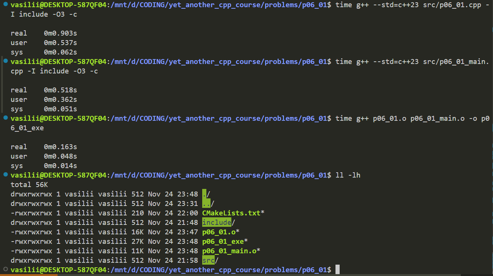
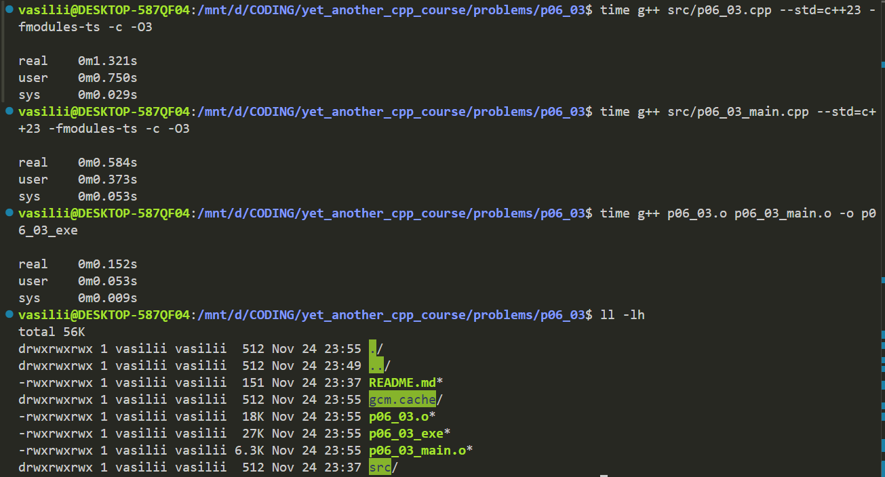
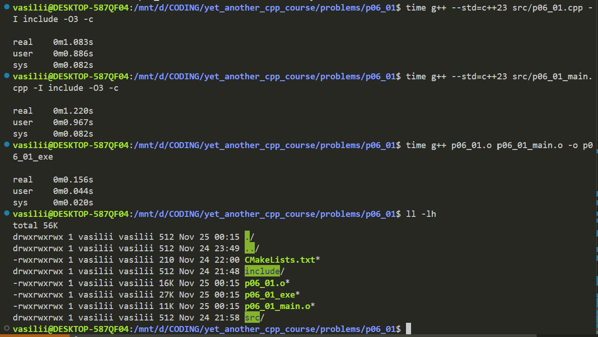
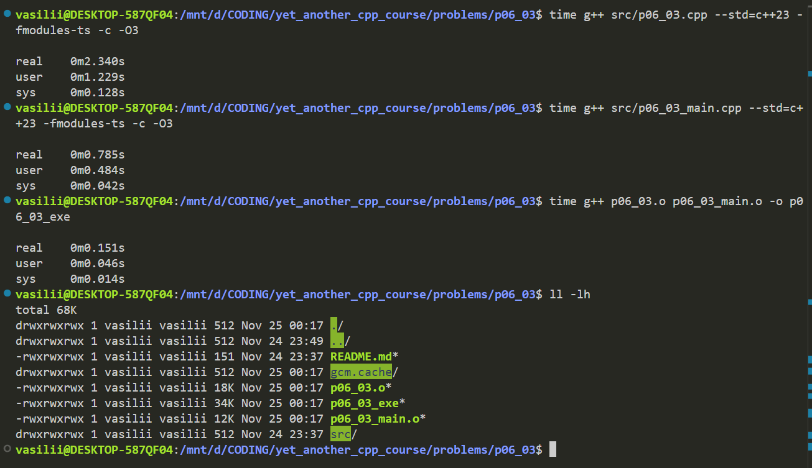

## Сравнение сборки с модулями и без

\
*Сборка без модулей*

\
*Сборка c модулями*

Можно увидеть, что в базовом варианте решение с модулями проигрывает по скорости сборки объектного файла. Однако суммарный размер бинарных файлов получается меньше.

Попробуем добавить в используемую библиотеку больше инклюдов, чтобы сымитировать сборку библиотеки с большим числом зависимостей.

\
*Сборка без модулей с большим количеством инклюдов*

\
*Сборка c модулями с большим количеством инклюдов*

Видно, что скорость компиляции файла с main для решения с модулями существенно лучше. Однако модули все еще проигрывают по общей скорости сборки. Так же решение с модулями продуцирует бОльшие бинарные файлы.

Таким образом, можно заключить, что модули могут существенно оптимизировать время компиляции C++ проектов. Но на данный момент работа с ними недостаточно оптимизирована.
